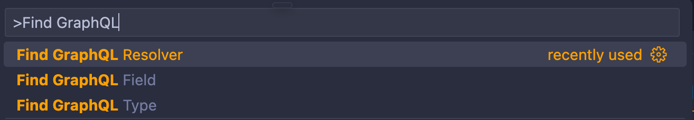

# GraphQL Intel

GraphQL Intel is a Visual Studio Code extension that helps you navigate and find GraphQL files with ease. It provides commands to locate and open GraphQL types, fields, and resolvers in your codebase.

## Installation

1. Open Visual Studio Code.
2. Go to the Extensions view by clicking on the Extensions icon in the Activity Bar on the side of the window or by pressing `Ctrl+Shift+X`.
3. Search for "GraphQL Intel".
4. Click "Install" to install the extension.

## Usage

### Commands



#### Find GraphQL Type

Locates and opens the file that contains the definition of a particular GraphQL type.

1. Open the Command Palette by pressing `Ctrl+Shift+P`.
2. Type `Find GraphQL Type` and select the command.
3. Enter the name of the GraphQL type you want to find.
4. The extension will locate and open the file that contains the definition of the specified type.

#### Find GraphQL Field

Locates and opens the file that contains the definition of a particular field of a GraphQL type.

1. Open the Command Palette by pressing `Ctrl+Shift+P`.
2. Type `Find GraphQL Field` and select the command.
3. Select the GraphQL type from the list.
4. Select the field name for the selected type.
5. The extension will locate and open the file that contains the definition of the specified field.

#### Find GraphQL Resolver

Locates and opens the file that contains the definition of a resolver.

1. Open the Command Palette by pressing `Ctrl+Shift+P`.
2. Type `Find GraphQL Resolver` and select the command.
3. Select the GraphQL resolver type (Query, Mutation, or Type).
4. If "Type" is selected, choose the GraphQL type from the list.
5. Select the resolver name for the selected type.
6. The extension will locate and open the file that contains the definition of the specified resolver.

## Configuration

The extension reads the configuration from a `graphql-lens.config.json` file in the root of your workspace. The configuration file should contain the following fields:

```json
{
  "graphqlFolder": "src/",
  "tabSize": 2
}
```

- `graphqlFolder`: The folder where your GraphQL files are located. The default value is `src/`.
- `tabSize`: The number of spaces used for indentation in your GraphQL files. The default value is `2`.

## Contributing

Contributions are welcome! If you find any issues or have suggestions for improvements, please open an issue or submit a pull request on the [GitHub repository](https://github.com/lioneltay/vscode-graphql-intel).

## License

This extension is licensed under the MIT License. See the [LICENSE](LICENSE) file for more details.
